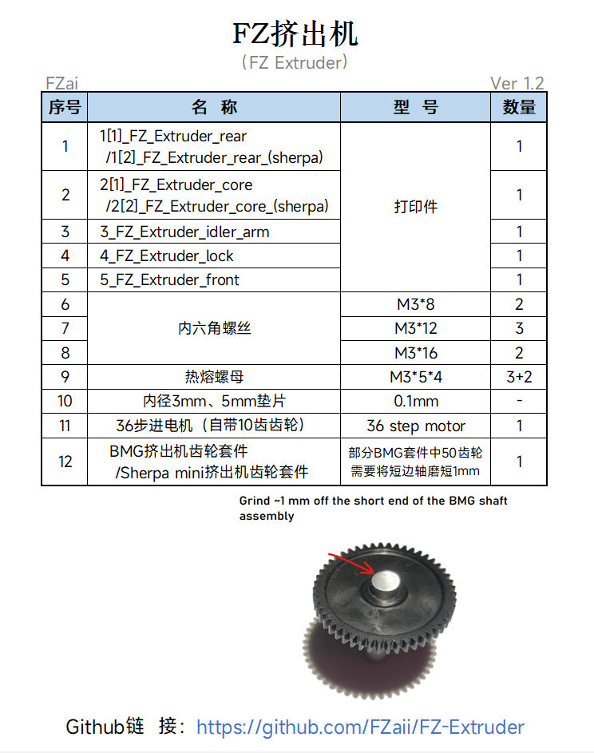

<h1 align="center">FZ Extruder</h1>

**
参考Sherpa进行改进和重新设计的BMG型挤出机
**

[Improved and redesigned BMG type extruder with reference to Sherpa extruders]

 ---
 

 
 ---

## 主要特点
> - [x] 轻量化
> - [x] 快速换料
> - [x] 镂空方便清洁
> - [x] 10齿36步进电机

**>****<**
## 更新历史

> **[Ver 1.2]** 2022.11.20  
> - 优化底部2个m3螺丝孔大小

 
## 备注
- 挤出轮臂根据[**`Sherpa mini`**](https://github.com/Annex-Engineering/Sherpa_Mini-Extruder) 修改而来

- **向下/向后** 两种固定方向
 
## 其他

